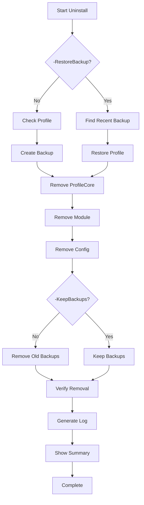

# ProfileCore Uninstall Features - Technical Deep Dive

## 🔧 Core Features Implementation

This document details the implementation of the three critical safety features in ProfileCore's uninstall system:

1. **Backup Support** - Automatic profile backup before changes
2. **Restore Support** - Ability to restore previous profile state
3. **Logging** - Comprehensive logging of all operations

---

## 💾 1. Backup Support

### Overview

The uninstaller **automatically creates a timestamped backup** of your PowerShell profile before making any modifications. This ensures you can always recover your profile if needed.

### How It Works

#### Automatic Backup Creation

```powershell
# Located in uninstall.ps1 lines 204-208
$timestamp = Get-Date -Format "yyyyMMdd_HHmmss"
$backupPath = "$profilePath.pre-uninstall-$timestamp.backup"
Copy-Item $profilePath $backupPath -Force
Write-Info "Profile backed up to: $backupPath"
```

**Example backup filename:**

```
Microsoft.PowerShell_profile.ps1.pre-uninstall-20250111_143022.backup
```

#### What Gets Backed Up

- ✅ **PowerShell Profile** - Your entire `$PROFILE` file
- ✅ **Timestamp** - Unique identifier for each backup
- ✅ **Location** - Same directory as your profile for easy access

#### Backup Locations

| Platform               | Location                                                                             |
| ---------------------- | ------------------------------------------------------------------------------------ |
| **Windows PowerShell** | `$HOME\Documents\PowerShell\Microsoft.PowerShell_profile.ps1.pre-uninstall-*.backup` |
| **Linux/macOS Bash**   | `~/.bashrc.pre-uninstall-*.backup`                                                   |
| **Linux/macOS Zsh**    | `~/.zshrc.pre-uninstall-*.backup`                                                    |

### Managing Backups

#### Keep Backups During Uninstall

```powershell
# Windows
.\scripts\installation\uninstall.ps1 -KeepBackups

# Unix/Linux
./scripts/installation/uninstall.sh --keep-backups
```

#### List All Backups

```powershell
# Windows
Get-ChildItem "$PROFILE.*.backup" | Sort-Object LastWriteTime -Descending

# Unix/Linux
ls -lht ~/.bashrc.*.backup 2>/dev/null | head -5
```

#### Manually Restore a Backup

```powershell
# Windows - Restore specific backup
Copy-Item "$PROFILE.pre-uninstall-20250111_143022.backup" $PROFILE -Force

# Unix/Linux - Restore specific backup
cp ~/.bashrc.pre-uninstall-20250111_143022.backup ~/.bashrc
```

---

## 🔄 2. Restore Support

### Overview

The uninstaller can **automatically find and restore your most recent profile backup**, allowing you to revert to your pre-ProfileCore state instantly.

### How It Works

#### Automatic Restore Process

```powershell
# Located in uninstall.ps1 lines 178-195
if ($RestoreBackup) {
    # Find most recent backup
    $backups = Get-ChildItem -Path (Split-Path $profilePath) `
        -Filter "$([System.IO.Path]::GetFileName($profilePath))*.backup" `
        -ErrorAction SilentlyContinue |
        Sort-Object LastWriteTime -Descending

    if ($backups) {
        $latestBackup = $backups[0]
        Write-Progress "Restoring backup: $($latestBackup.Name)..." 25

        try {
            Copy-Item $latestBackup.FullName $profilePath -Force
            Write-Success "Profile restored from backup: $($latestBackup.Name)"
        } catch {
            Write-Warning "Failed to restore backup: $_"
        }
    } else {
        Write-Warning "No profile backups found"
    }
}
```

### Restore Options

#### Option 1: Restore During Uninstall

**Most convenient** - Restores as part of the uninstall process:

```powershell
# Windows
.\scripts\installation\uninstall.ps1 -RestoreBackup

# Unix/Linux
./scripts/installation/uninstall.sh --restore-backup
```

**What happens:**

1. ✅ Finds most recent backup automatically
2. ✅ Restores it to your profile location
3. ✅ Completes uninstallation
4. ✅ Your profile is back to pre-ProfileCore state

#### Option 2: Manual Restore

If you want to restore after uninstalling:

```powershell
# Windows - List backups
$backups = Get-ChildItem "$PROFILE*.backup" | Sort-Object LastWriteTime -Descending

# Show available backups
$backups | Select-Object Name, LastWriteTime

# Restore most recent
Copy-Item $backups[0].FullName $PROFILE -Force

# Unix/Linux - List and restore
backups=($(ls -t ~/.bashrc.*.backup))
echo "${backups[@]}"  # Show available
cp "${backups[0]}" ~/.bashrc  # Restore most recent
```

### Restore Priority

The restore system prioritizes backups in this order:

1. **Pre-uninstall backups** - Created just before removal
2. **Installation backups** - Created during install
3. **Manual backups** - Any other `.backup` files

### Safety Features

✅ **Non-destructive** - Original backup files are preserved  
✅ **Automatic selection** - Always picks the most recent  
✅ **Validation** - Checks if backups exist before attempting restore  
✅ **Error handling** - Graceful failure with helpful messages

---

## 📝 3. Logging System

### Overview

The uninstaller creates a **comprehensive, timestamped log** of every action, making it easy to verify what was removed and troubleshoot any issues.

### How It Works

#### Log Collection

Throughout the uninstall process, every significant action is recorded:

```powershell
# Script-level log array (line 7)
$script:UninstallLog = @()

# Each Write-Step and Write-Success adds to log
function Write-Step {
    param([string]$Message)
    if (-not $Quiet) {
        Write-Host "🔹 $Message" -ForegroundColor Cyan
    }
    $script:UninstallLog += $Message  # ← Logged here
}

function Write-Success {
    param([string]$Message)
    if (-not $Quiet) {
        Write-Host "✅ $Message" -ForegroundColor Green
    }
    $script:UninstallLog += "[SUCCESS] $Message"  # ← Logged here
}
```

#### Log Generation

At the end of uninstallation (lines 73-95):

```powershell
function Write-UninstallLog {
    param([string]$LogFile)

    $logContent = @"
ProfileCore Uninstallation Log
Generated: $(Get-Date -Format "yyyy-MM-dd HH:mm:ss")
User: $env:USERNAME
Computer: $env:COMPUTERNAME

========================================
Uninstallation Steps:
========================================

$($script:UninstallLog -join "`n")

========================================
Status: Completed Successfully
========================================
"@

    Set-Content -Path $LogFile -Value $logContent -Force
    Write-Info "Uninstallation log saved: $LogFile"
}
```

#### Log Creation

The log is automatically generated at the end (lines 329-333):

```powershell
# Step 7: Generate uninstall log (95-100%)
Write-Progress "Generating uninstallation log..." 95

$logFile = Join-Path $env:TEMP "profilecore-uninstall-$(Get-Date -Format 'yyyyMMdd-HHmmss').log"
Write-UninstallLog $logFile
```

### Log Contents

#### What's Included

Each log contains:

| Section          | Information                         |
| ---------------- | ----------------------------------- |
| **Header**       | Date, time, user, computer name     |
| **Steps**        | Every action taken during uninstall |
| **Successes**    | Confirmed completions               |
| **Warnings**     | Non-critical issues encountered     |
| **Errors**       | Critical problems (if any)          |
| **Verification** | Final status checks                 |
| **Summary**      | Overall completion status           |

#### Example Log Output

```
ProfileCore Uninstallation Log
Generated: 2025-01-11 14:30:45
User: JohnDoe
Computer: DESKTOP-ABC123

========================================
Uninstallation Steps:
========================================

Starting ProfileCore uninstallation...
Unloading ProfileCore module
[SUCCESS] Module unloaded from current session
Handling PowerShell profile
[SUCCESS] Profile backed up to: C:\Users\JohnDoe\Documents\PowerShell\Microsoft.PowerShell_profile.ps1.pre-uninstall-20250111_143045.backup
[SUCCESS] ProfileCore references removed from profile
Removing ProfileCore module
[SUCCESS] ProfileCore module removed (45 files)
Removing configuration files
[SUCCESS] Configuration directory removed
Removing profile backups
[SUCCESS] Backup files removed
Verifying uninstallation
[SUCCESS] Module directory removed
[SUCCESS] Module not loaded
[SUCCESS] Config directory removed

========================================
Status: Completed Successfully
========================================
```

### Using Logs

#### View Logs

**Windows:**

```powershell
# View most recent log
$latestLog = Get-ChildItem $env:TEMP\profilecore-uninstall-*.log |
    Sort-Object LastWriteTime -Descending |
    Select-Object -First 1
notepad $latestLog.FullName

# Or quickly display in terminal
Get-Content $latestLog.FullName
```

**Unix/Linux:**

```bash
# View most recent log
latest_log=$(ls -t /tmp/profilecore-uninstall-*.log | head -1)
cat "$latest_log"

# Or with pagination
less "$latest_log"
```

#### Log Locations

| Platform       | Location    | Pattern                                     |
| -------------- | ----------- | ------------------------------------------- |
| **Windows**    | `$env:TEMP` | `profilecore-uninstall-YYYYMMDD-HHMMSS.log` |
| **Unix/Linux** | `/tmp/`     | `profilecore-uninstall-YYYYMMDD-HHMMSS.log` |

**Example:**

```
C:\Users\JohnDoe\AppData\Local\Temp\profilecore-uninstall-20250111-143045.log
/tmp/profilecore-uninstall-20250111-143045.log
```

#### Cleanup Old Logs

```powershell
# Windows - Remove logs older than 30 days
Get-ChildItem $env:TEMP\profilecore-uninstall-*.log |
    Where-Object { $_.LastWriteTime -lt (Get-Date).AddDays(-30) } |
    Remove-Item

# Unix/Linux - Remove logs older than 30 days
find /tmp/ -name "profilecore-uninstall-*.log" -mtime +30 -delete
```

---

## 🔄 How The Features Work Together

### The Complete Uninstall Flow



### Example: Complete Safe Uninstall

```powershell
# Run uninstall with all safety features
.\scripts\installation\uninstall.ps1 -KeepBackups

# What happens:
# 1. ✅ Confirms with user
# 2. 💾 Creates backup: $PROFILE.pre-uninstall-20250111_143045.backup
# 3. 🗑️ Removes ProfileCore from profile
# 4. 🗑️ Removes module files
# 5. 🗑️ Removes configuration (unless -KeepConfig)
# 6. 💾 Preserves backups (-KeepBackups flag)
# 7. ✅ Verifies removal
# 8. 📝 Creates log: profilecore-uninstall-20250111-143045.log
# 9. 📊 Shows summary

# Result:
# - ProfileCore removed ✅
# - Backup preserved ✅
# - Log created ✅
# - Can restore anytime ✅
```

### Example: Emergency Restore

If you need to quickly restore after uninstalling:

```powershell
# Windows - Restore most recent backup
$backup = Get-ChildItem "$PROFILE*.backup" |
    Sort-Object LastWriteTime -Descending |
    Select-Object -First 1
Copy-Item $backup.FullName $PROFILE -Force
. $PROFILE  # Reload

# Unix/Linux - Restore most recent backup
backup=$(ls -t ~/.bashrc.*.backup | head -1)
cp "$backup" ~/.bashrc
source ~/.bashrc
```

---

## 🛡️ Safety Guarantees

The combination of these three features provides multiple safety nets:

| Scenario                 | Protection                                 |
| ------------------------ | ------------------------------------------ |
| **Accidental uninstall** | Backup + Restore: Can undo instantly       |
| **Something goes wrong** | Logs: Can see exactly what happened        |
| **Need previous config** | Backups: Multiple restore points available |
| **Troubleshooting**      | Logs: Complete audit trail                 |
| **Want to revert**       | Restore: One command to undo               |

---

## 📊 Feature Comparison

| Feature            | Standard Uninstall | With Backup Support | With Restore | With Logging |
| ------------------ | ------------------ | ------------------- | ------------ | ------------ |
| Remove ProfileCore | ✅                 | ✅                  | ✅           | ✅           |
| Safety Backup      | ❌                 | ✅                  | ✅           | ✅           |
| Quick Restore      | ❌                 | ⚠️ Manual           | ✅           | ✅           |
| Audit Trail        | ❌                 | ❌                  | ❌           | ✅           |
| Troubleshooting    | ⚠️ Limited         | ⚠️ Limited          | ⚠️ Limited   | ✅           |
| Recommended?       | ❌                 | ⚠️ Good             | ✅ Better    | ✅ Best      |

---

## 🎯 Best Practices

### Before Uninstalling

1. **Check what you'll lose:**

   ```powershell
   Get-Command -Module ProfileCore  # See all commands
   ```

2. **Review your configuration:**

   ```powershell
   notepad "$HOME\.config\shell-profile\config.json"
   ```

3. **List current backups:**
   ```powershell
   Get-ChildItem "$PROFILE*.backup"
   ```

### During Uninstall

**Recommended command for maximum safety:**

```powershell
# Windows
.\scripts\installation\uninstall.ps1 -KeepConfig -KeepBackups

# Unix/Linux
./scripts/installation/uninstall.sh --keep-config --keep-backups
```

This preserves:

- ✅ Your configuration files
- ✅ All backup files
- ✅ Ability to reinstall easily

### After Uninstall

1. **Check the log:**

   ```powershell
   notepad $env:TEMP\profilecore-uninstall-*.log
   ```

2. **Verify removal:**

   ```powershell
   Get-Module ProfileCore  # Should be empty
   ```

3. **Test your profile:**
   ```powershell
   . $PROFILE  # Should load without errors
   ```

---

## 📞 Support

If you encounter issues with any of these features:

1. **Check the log** - Most issues are documented there
2. **Review backups** - Ensure they exist and are valid
3. **Try restore** - Use `-RestoreBackup` to undo
4. **Manual recovery** - See [docs/UNINSTALL.md](UNINSTALL.md)

---

**Version**: 5.0.0  
**Last Updated**: 2025-01-11  
**Status**: ✅ Production Ready
