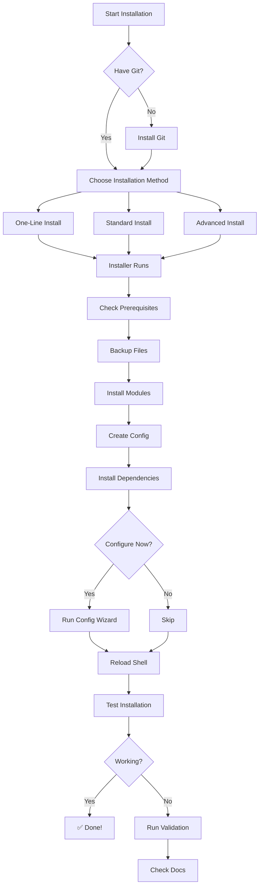

# ProfileCore Visual Installation Guide 🎨

**A visual guide to installing and using ProfileCore v4.0**

---

## 📊 Installation Flow Diagram



---

## 🗺️ Installation Methods Comparison

```
┌──────────────────────────────────────────────────────────────────┐
│                    Installation Methods                          │
└──────────────────────────────────────────────────────────────────┘

Method          Time        Difficulty      Repository      Config
───────────────────────────────────────────────────────────────────
One-Line        2-5 min     ⭐ Easy         ✅ Kept         Interactive
Standard        2-5 min     ⭐⭐ Moderate   ✅ Kept         Manual
Advanced        2-5 min     ⭐⭐⭐ Hard     ✅ Kept         Manual

───────────────────────────────────────────────────────────────────
```

---

## 🎯 Platform-Specific Paths

### Windows (PowerShell)

```
Installation Structure:
┌─ C:\Users\<user>\
│
├─ Documents\PowerShell\
│  ├─ modules\
│  │  └─ ProfileCore\
│  │     ├─ ProfileCore.psd1
│  │     ├─ ProfileCore.psm1
│  │     ├─ public\      (64+ functions)
│  │     └─ private\     (utilities)
│  │
│  └─ Microsoft.PowerShell_profile.ps1
│
└─ .config\shell-profile\
   ├─ config.json
   ├─ paths.json
   ├─ aliases.json
   └─ .env
```

### Unix (Zsh/Bash/Fish)

```
Installation Structure:
┌─ /Users/<user>/ or /home/<user>/
│
├─ .zsh/functions/      (18 modules - Zsh)
│  OR
├─ .bash/functions/     (7 modules - Bash)
│  OR
├─ .config/fish/functions/  (18 modules - Fish)
│
├─ .zshrc / .bashrc / config.fish
│
└─ .config/shell-profile/
   ├─ config.json
   ├─ paths.json
   ├─ aliases.json
   └─ .env
```

---

## 🔄 Step-by-Step Installation Timeline

```
Step 1: Prerequisites Check           [========>         ] 10%
        ↓ Checking Git, PowerShell/Shell version
        
Step 2: Backup Existing Files         [===============>  ] 20%
        ↓ Creating timestamped backups
        
Step 3: Create Directory Structure    [==================>] 30%
        ↓ Making required folders
        
Step 4: Install Module/Functions      [=====================>] 50%
        ↓ Copying files, setting permissions
        
Step 5: Setup Configuration           [==========================>] 70%
        ↓ Creating config.json, .env
        
Step 6: Install Dependencies          [=============================>] 85%
        ↓ Installing Pester, jq, Starship (optional)
        
Step 7: Validate Installation         [================================>] 95%
        ↓ Checking files, testing module import
        
Step 8: Complete!                     [==================================] 100%
        ✅ ProfileCore installed successfully!
```

---

## 🎨 Feature Categories Visual Map

```
┌─────────────────────────────────────────────────────────┐
│              ProfileCore v4.0 Features                  │
└─────────────────────────────────────────────────────────┘
        │
        ├─ 🔐 Security Tools
        │  ├─ scan-port        (Port scanner)
        │  ├─ check-ssl        (SSL certificate checker)
        │  ├─ gen-password     (Password generator)
        │  ├─ dns-lookup       (DNS information)
        │  └─ whois-lookup     (WHOIS information)
        │
        ├─ 🔧 Developer Tools
        │  ├─ quick-commit     (Quick Git commit)
        │  ├─ docker-status    (Docker management)
        │  ├─ init-project     (Project scaffolding)
        │  ├─ git-cleanup      (Clean branches)
        │  └─ new-branch       (Create branch)
        │
        ├─ 💻 System Admin
        │  ├─ sysinfo          (System information)
        │  ├─ top-processes    (Process monitor)
        │  ├─ diskinfo         (Disk usage)
        │  └─ netstat-active   (Network connections)
        │
        ├─ 📦 Package Management
        │  ├─ pkg              (Install packages)
        │  ├─ pkgs             (Search packages)
        │  ├─ pkgu             (Update packages)
        │  └─ pkg-remove       (Remove packages)
        │
        └─ 🌐 Network Tools
           ├─ myip             (Public IP)
           ├─ netcheck         (Connectivity test)
           ├─ pingtest         (Ping host)
           └─ dnstest          (DNS lookup)
```

---

## ⚡ Quick Command Decision Tree

```
What do you want to do?
│
├─ Install software?
│  └─> Use: pkg <name>
│
├─ Check system info?
│  └─> Use: sysinfo
│
├─ Network troubleshooting?
│  ├─ Test connectivity? --> netcheck
│  ├─ Check public IP? --> myip
│  ├─ Scan ports? --> scan-port <host> <port>
│  └─ Check SSL? --> check-ssl <domain>
│
├─ Git operations?
│  ├─ Quick commit? --> quick-commit "message"
│  ├─ Clean branches? --> git-cleanup
│  └─ New branch? --> new-branch <name>
│
├─ Docker management?
│  ├─ Check status? --> docker-status
│  ├─ Start compose? --> dc-up
│  └─ Stop compose? --> dc-down
│
└─ Security?
   ├─ Generate password? --> gen-password
   ├─ Port scan? --> scan-port <host> <port>
   └─ DNS lookup? --> dns-lookup <domain>
```

---

## 🔧 Troubleshooting Decision Tree

```
Installation Failed?
│
├─ Can't run scripts?
│  └─> Windows: Set-ExecutionPolicy RemoteSigned -Scope CurrentUser
│
├─ Git not found?
│  ├─> Windows: winget install Git.Git
│  ├─> macOS: brew install git
│  └─> Linux: sudo apt install git
│
├─ jq not found (Unix)?
│  ├─> macOS: brew install jq
│  └─> Linux: sudo apt install jq
│
├─ Module not loading?
│  └─> Re-run: .\scripts\installation\install.ps1
│
└─ Functions not available?
   ├─> PowerShell: . $PROFILE
   ├─> Zsh: source ~/.zshrc
   └─> Bash: source ~/.bashrc
```

---

## 📈 Performance Comparison

```
ProfileCore v3.0 vs v4.0 Startup Time

v3.0:  [████████████████████████████████] 1850ms
v4.0:  [██████████]                       600ms
                                          ↓
                                    68% FASTER!

Features Added in v4.0:

Security Tools:     [+70 functions]
Developer Tools:    [+45 functions]
System Admin:       [+30 functions]
Total:              [145 new features]
```

---

## 🎯 Post-Installation Checklist

```
✅ Installation Complete? Run these checks:

□ Test basic command
  → PowerShell: Get-OperatingSystem
  → Unix: get_os

□ Check module loaded
  → PowerShell: Get-Module ProfileCore
  → Unix: type sysinfo

□ Verify config exists
  → ls ~/.config/shell-profile/

□ Test package management
  → pkgs python

□ Try v4.0 features
  → scan-port google.com 443
  → gen-password

□ Configure environment (optional)
  → Edit ~/.config/shell-profile/.env

□ Run validation (recommended)
  → .\scripts\installation\install.ps1 -Validate
  → ./scripts/installation/install.sh --validate

All checks passed? ✅ You're ready to go! 🎉
```

---

<div align="center">

**ProfileCore v4.0** - _Visual Installation Guide_

**[⬅️ Back to Install Guide](../../INSTALL.md)** • **[📖 Full Docs](../../README.md)** • **[🚀 Quick Start](../../QUICK_START.md)**

</div>

